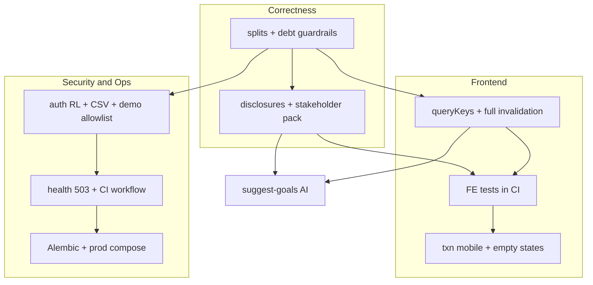

# Multi-discipline review — implementation plan (v3)

**v3** incorporates a **second review** by the same seven roles against this document + codebase. **Corrections:** split bug severity (category totals can be **omitted**, not only inconsistent); invalidation scope beyond `["reports"]`; DEMO_MODE **allows** `execute-action` today; health is **200 + degraded**, not 503 yet; spending-by-month is **parent-only by design** (do not naïvely “add children” without double-count analysis). **Added:** acceptance hooks, stakeholder disclosure pack, QA matrix, DevOps/security depth, mermaid disclaimer.

## Cross-discipline consensus (refined)

| Theme | Action |
|--------|--------|
| Trust & disclosure | Month-local envelope; **no YNAB-style category rollover** in current API; reports often **all accounts** vs budget **budget accounts**; **multi-currency** summed without FX; debt sim assumptions; **not advice**; AI goal context may **diverge** from Goals tab until aligned. |
| Data correctness | **Splits:** category paths today **drop** split children; some AI paths **include** them—unify with explicit rules; **month totals** stay parent-level to match movements. |
| Stale UI after sync | Invalidate **all** money-viz keys: report queries **and** dashboard (`spending-by-month` has **two key shapes**), plus `aiInsights`, `recurring`, `budgetInsights`, `payoffPlan`, `fsa-review` as needed. |
| Security / ops | **Demo:** `/api/ai/` allowlist is **overbroad** (`execute-action` writes). **Health:** implement **503**. **CI:** add workflow (none in repo). **CSV:** cap size/rows (demo upload already blocked). |

## Phase A — Correctness & trust (Financial + Backend)

1. **Splits & category aggregates** — Implement shared rule (see `splits-budget-reports-ai` todo): typically **sum lines with `category_id` set** including **split children**; **exclude** uncategorized split **parents** from category rolls; **keep** parent-only for **month-level** rollups and balances to avoid double-counting. Grep all `Transaction` + `Category` aggregates. Add **fixtures + integration tests**.
2. **Debt simulation** — Flags for defaults; **non-convergence** after cap; **negative amortization** warning; UI disclaimer; deterministic `/payoff-plan` **primary** vs LLM copy.
3. **AI context** — Align goal enrichment with `list_goals` **or** disclose mismatch in-product.
4. **Copy / disclosures** — As-of sync; budget vs reports scope; multi-currency label; transfers policy once defined.

## Phase B — Frontend reliability

1. **`queryKeys` + prefix invalidation** — One module; invalidate families after sync (not a single dead `["reports"]` key).
2. **Tests** — Vitest + **MSW/mock** for RQ hooks; Playwright smoke; **CI required for merge** (policy).
3. **Reports** — Lazy tabs; note **multiple queries per tab** (e.g. spending + top payees).
4. **Charts** — Dynamic import Recharts; tighten TypeScript on optimistic updates.

## Phase C — Security & DevOps quick wins

1. **Auth rate limits** — Separate from AI quotas (`ai-idempotency-limits`).
2. **CSV limits** — Bytes + rows (production abuse); clarify **not** about demo (upload blocked there).
3. **Demo allowlist** — Narrow to non-mutating AI paths; **block `execute-action`** in demo.
4. **Health** — **Implement** 503 when DB down (document **current** 200+JSON degraded).
5. **CI pipeline** — Create workflow; `backend/requirements.txt` + Postgres service; correct working directories.
6. **Ollama URL** — SSRF-hardening via env validation.
7. **SCA/SAST + security.txt** — Dependency scan + lightweight SAST; disclosure contact.

**Parallel work:** Phase C items can run **alongside** late Phase A **if** `qa-regression-matrix` passes for splits/debt—avoid masking correctness bugs.

## Phase D — UX & product polish

See todos: `txn-mobile-a11y`, `empty-states-audit`, `budget-ai-panel-states`, `simplefin-first-sync-ux`, `clarity-ia-copy`, `activation-analytics`. **UX edge cases** to respect: filtered-empty vs true-empty txns; **mermaid node letters ≠ Phase D/E** (diagram is logical flow only).

## Phase E — Platform depth

Alembic; sync batching; GET sync read-only; session commits; JWT/CSP **phased**; prod Docker; backups + restore drill (in `devops-ops-baseline` or explicit runbook); feature flags optional; staging pipeline optional.

## Phase F — Product features

- **Suggest goals AI** — After **A + B + disclosures** baseline.
- **Optional** — Create payoff goal from Debt tab; goal reorder; webhooks (or mark **out of scope** in `webhooks-scope`).

## Acceptance criteria (Definition of Done hooks)

| Initiative | Accept when |
|------------|-------------|
| Splits fix | Golden cases: budget category activity = reports category = chosen AI aggregates; documented predicate; tests green. |
| Debt guardrails | Missing APR/min visible; non-convergent plans flagged; disclaimer shipped. |
| Disclosures | Plan/AI/debt/report surfaces audited; support macros ready; sign-off recorded if legal involved. |
| Query invalidation | After sync: reports **and** dashboard money widgets refresh without hard reload (E2E or scripted). |
| Demo AI | Automated check: demo cannot persist via `execute-action` (once narrowed). |
| Health | Probe gets **503** when DB unreachable. |
| CI | Required checks green on PR; documented branch protection. |

## Dependencies (mermaid)

**Note:** Node labels **A–I** are **not** the same as “Phase A/B/…”. **CI** is a **horizontal** enabler—not strictly after UX.

## Risks called out in review

- **Security before correctness:** Rate limits and demo masking can **hide** reproduction of split/debt bugs—use **`qa-regression-matrix`**.
- **CSP/JWT early:** High blast-radius—**do not** combine with heavy correctness churn in one release.
- **Duplicate sprint work:** Rate limits appear in auth + AI—**coordinate** thresholds; **one CI epic** (`ci-pipeline`).

## Document history

- **v1**: Initial merge of seven discipline reviews.
- **v2**: (Superseded) partial FE agent note—fully merged into v3.
- **v3**: Second pass by seven sub-agents—factual fixes, edge cases, new todos, acceptance criteria, diagram disclaimer, deduplication.
