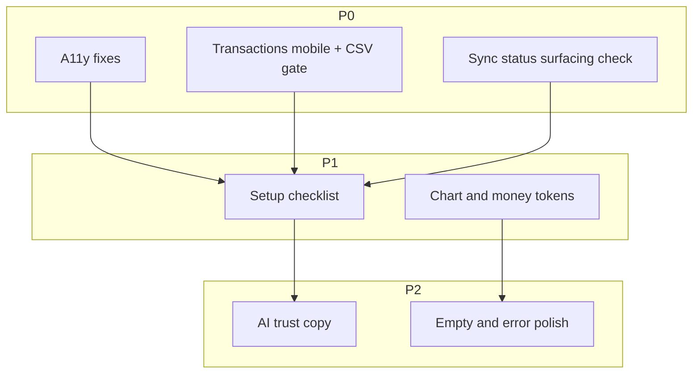
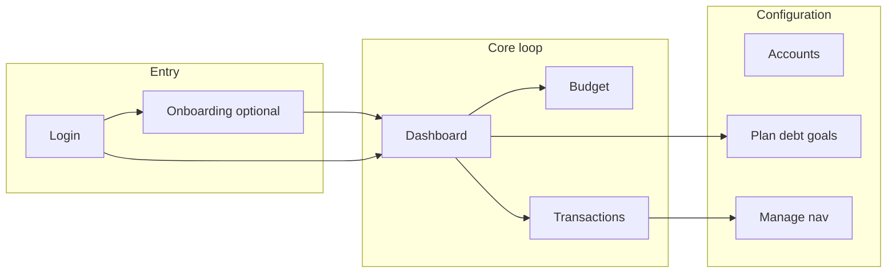

# Principal UX review: Budget app (second pass)

## Scope and limits

- **In scope**: Navigation IA, dashboard, transactions, budget/plan (as represented in code), onboarding + settings (SimpleFIN), AI advisor + dashboard insights, auth shell, error boundary patterns.
- **Out of scope**: Backend threat modeling, legal/compliance sign-off, full content strategy for every string, exhaustive visual regression, non-English locales.
- **Method**: Static review of [`frontend/`](frontend/); **re-rank** findings after moderated sessions ([Validation](#validation)).

## Executive summary

The app behaves like a **serious personal finance tool**: clear Primary vs Manage IA, candid bank-connection copy, staged AI, and snappy feedback loops. The next quality tier is about **inclusive defaults** (a11y, mobile density), **honest AI positioning**, and **guiding users who skip setup** without nagging experts. Secondary surfaces (Reports, Rules, etc.) still deserve a focused pass once core loops score well on usability tests.

## People and jobs-to-be-done

These are **design archetypes** (not full personas)—each ties to pain in the current UX and to backlog items.

### 1. “Importer Sam” — get history in fast

- **Job**: “I need last quarter’s transactions categorized without fighting the UI.”
- **Typical path**: Skip onboarding → Transactions → Import CSV.
- **Friction today**: Toolbar crowding on small screens; Import depends on account filter but the UI does not **prime** that dependency; export/import parity is easy to confuse.
- **Backlog mapping**: `mobile-txn-toolbar` (P0); empty-state hints on txn list (P2).

### 2. “Migrator Morgan” — coming from YNAB / Monarch / Mint

- **Job**: “I already know envelope budgeting—show me Ready to Assign and don’t hide Plan.”
- **Typical path**: Dashboard → Budget → Plan (debt/goals).
- **Friction today**: Plan is powerful but **bundled**; deep links `?tab=` help power users but are invisible to newcomers; product name/value prop do not signal **methodology** (envelope vs spreadsheet).
- **Backlog mapping**: `setup-checklist` (P1); brand/value prop copy (P2); optional Plan hub labels.

### 3. “Connecter Casey” — bank-first, low technical patience

- **Job**: “Connect my bank and see real balances today.”
- **Typical path**: Onboarding step 2 or Settings → SimpleFIN popup/token.
- **Friction today**: Popup + token flow is honest but **cognitively heavy**; mobile drawer must surface **sync outcome** (success/failure) not only toasts.
- **Backlog mapping**: Verify sync error UX in mobile nav (P0 gap-check); onboarding already strong—avoid adding steps; consider **progress text** during first sync (“Usually under a minute”).

### 4. “Keyboard Riley” — power user, accessibility needs

- **Job**: “Categorize and clear dozens of rows without the mouse.”
- **Typical path**: Transactions table, dialogs, AI panel.
- **Friction today**: Collapsible insights lack disclosure state; Link-wrapped buttons break predictable tab order; floating panel may not return focus.
- **Backlog mapping**: `a11y-pass` (P0).

### 5. “Skeptical Sage” — AI-curious but privacy-first

- **Job**: “Explain my spending without sending my entire ledger to the cloud.”
- **Typical path**: Toggle insights; open floating advisor; confirm a parsed action.
- **Friction today**: Empty-state copy may **over-claim** access; Claude vs Ollama differs in data residency; confirm step needs **scannable** numbers before Commit.
- **Backlog mapping**: `ai-trust-copy` (P2 but high trust impact); settings link “What the AI sees.”

**Coverage check**: If all five archetypes can complete their primary job in one session without support, the core UX is in good shape.

## What is working well

- **IA — Primary vs Manage** ([`frontend/src/components/navigation.tsx`](frontend/src/components/navigation.tsx)): Matches how people separate “money work” from “database tuning.”
- **First-run guidance** ([`frontend/src/app/page.tsx`](frontend/src/app/page.tsx)): Three concrete entry paths + dismissible banner respects returning users.
- **Bank honesty** ([`frontend/src/app/onboarding/page.tsx`](frontend/src/app/onboarding/page.tsx), [`frontend/src/app/settings/page.tsx`](frontend/src/app/settings/page.tsx)): Explains SimpleFIN, popups, paste, and blocker recovery without corporate fog.
- **AI staging** ([`frontend/src/components/ai-advisor.tsx`](frontend/src/components/ai-advisor.tsx), insights on dashboard): Optional, state-labeled, suggested prompts—avoids noisy “AI slop.”
- **Reactive system** ([`frontend/src/app/transactions/page.tsx`](frontend/src/app/transactions/page.tsx), React Query): Optimistic cleared toggle + invalidation on sync completion builds **trust through speed**.

## Gaps and risks (detailed)

Each item: **Issue** → **User impact** → **Example scenario** → **Recommendation** → **Heuristic** (Nielsen-style anchor).

### 1. Brand and product story

- **Issue**: Generic “Budget” naming ([`frontend/src/app/layout.tsx`](frontend/src/app/layout.tsx), nav).
- **User impact**: Weak differentiation; harder to justify **why** bank tokens or AI are safe **here**.
- **Example**: User compares two apps in memory a week later—“the gray budgeting one” is not enough.
- **Recommendation**: Single product name; login subtitle = one concrete promise (read-only bank / envelope / local AI—pick **one** lead, two supporting words max).
- **Heuristic**: Recognition rather than recall; match between system and real world.

### 2. Visual system — charts and money semantics

- **Issue**: Pie `COLORS` constant vs theme `--chart-*` ([`frontend/src/app/page.tsx`](frontend/src/app/page.tsx), [`frontend/src/app/globals.css`](frontend/src/app/globals.css)); heavy green/red on amounts.
- **User impact**: Dark mode and brand drift; “red” on every debit trains **alarm fatigue**; transfers/read-only views feel “wrong.”
- **Example**: User sees a routine grocery spend in red on dashboard recent list and assumes overspending.
- **Recommendation**: Inject chart colors from computed CSS vars; publish a **three-tier rule**: (1) **semantic** green/red only for net worth / goals / debt summaries where polarity matters, (2) **muted** for routine signed amounts, (3) **neutral** for transfers and pending.
- **Heuristic**: Aesthetic and minimalist design; consistency and standards.

### 3. Information architecture — Plan hub and setup dropout

- **Issue**: Large Plan surface + URL tabs ([`frontend/src/app/plan/page.tsx`](frontend/src/app/plan/page.tsx)); no persistent setup path after skip.
- **User impact**: Debt and goals are emotionally loaded; burying them increases **avoidance**; skip users stall silently.
- **Example**: User skips onboarding, dismisses welcome banner after adding one manual account, never discovers debt snowball.
- **Recommendation**: Checklist rows: *Add account* · *Sync or import* · *Assign first month* · *Optional: connect bank* · *Optional: first goal*—shown on dashboard (compact) and Settings (full). First visit to Plan: one sentence “Debt tools and savings goals live here” above tabs.
- **Heuristic**: Visibility of system status; help users recognize where they are.

### 4. Transactions — density and prerequisites

- **Issue**: Four+ actions in header row ([`frontend/src/app/transactions/page.tsx`](frontend/src/app/transactions/page.tsx)); CSV needs `filters.account_id`.
- **User impact**: Mis-taps; wasted import attempts; feeling “the app is broken.”
- **Example**: Sam taps Import on iPhone before choosing account—toast flashes; filter row may be off-screen after scroll.
- **Recommendation**: `<md`: **Add** primary, **⋯** overflow (Import, Export, Transfer) or split into two rows with clear hierarchy; Import opens step 1 “Which account?” if none selected; disable with tooltip/subtext inline near button.
- **Heuristic**: Error prevention; flexibility and efficiency of use.

### 5. Accessibility

- **Issue**: Insights toggle without `aria-expanded` / `aria-controls` ([`frontend/src/app/page.tsx`](frontend/src/app/page.tsx)); `Link` > `button` in welcome banner; AI panel focus behavior unverified ([`frontend/src/components/ai-advisor.tsx`](frontend/src/components/ai-advisor.tsx)).
- **User impact**: Screen reader users cannot tell if suggestions are open; keyboard users hit duplicate focus stops; panel may strand focus off-screen.
- **Example**: VoiceOver reads “button” twice for the same CTA; user opens AI, closes it, focus disappears.
- **Recommendation**: Use `aria-expanded={open}` on insights control; wire `id` on panel region; `Button asChild` + `Link` or `Link` with button styles; on AI open: focus first focusable in panel; on close: restore focus to FAB; `Escape` closes; consider `role="dialog"` + `aria-modal` if behavior matches a dialog.
- **Heuristic**: Flexibility and efficiency; error prevention.

### 6. Mobile-specific

- **Issue**: “Tap” copy ([`frontend/src/app/page.tsx`](frontend/src/app/page.tsx)); FAB + fixed panel height ([`frontend/src/components/ai-advisor.tsx`](frontend/src/components/ai-advisor.tsx)); sync status mostly in sidebar/sheet.
- **User impact**: Minor polish hits trust; AI chrome may obscure last rows; failed sync invisible.
- **Example**: User completes SimpleFIN on phone; sync fails; only a toast—user thinks data is current.
- **Recommendation**: Device-agnostic verbs (“Open debt plan”); `padding-bottom: env(safe-area-inset-bottom)` on fixed layers; duplicate **last sync + error** summary in mobile header or dashboard card when state is non-success.
- **Heuristic**: Visibility of system status.

### 7. Trust and AI expectations

- **Issue**: Broad “access to your accounts…” claim; backend may be partial context; confirm UI for actions ([`frontend/src/components/ai-advisor.tsx`](frontend/src/components/ai-advisor.tsx)).
- **User impact**: Legal-tinged mistrust; confirm fatigue or wrong confirms.
- **Example**: Sage thinks entire transaction dump is sent to Claude; stops using feature.
- **Recommendation**: Replace with accurate scope: “Uses summaries and recent activity you allow” vs “Runs locally” badge path; link to settings; Confirm block shows **Amount · From/To · Date** in large type before buttons.
- **Heuristic**: Help users recognize errors; match system to real world.

### 8. Empty and error states

- **Issue**: Single-line empties on dashboard modules ([`frontend/src/app/page.tsx`](frontend/src/app/page.tsx)); error boundary resets local state only ([`frontend/src/components/error-boundary.tsx`](frontend/src/components/error-boundary.tsx)).
- **User impact**: Users don’t know **next** step; persistent render errors need full reload.
- **Example**: “No spending data” with no CTA to categorize or pick month.
- **Recommendation**: Pattern: headline + one line why + primary button (+ secondary text link); add **Reload page** next to Try when error message suggests broken tree.
- **Heuristic**: Help users recover; visibility of status.

### 9. Auth and passkey mental model

- **Issue**: Register path is passkey-centric; sign-in may be password-first ([`frontend/src/app/login/page.tsx`](frontend/src/app/login/page.tsx)—verify current copy).
- **User impact**: Users create passkey then later forget and attempt password-only; support burden.
- **Recommendation**: Microcopy: “Sign-in methods you’ve enabled” list; link to recovery; avoid toggling modes without restating consequences.
- **Heuristic**: Error prevention; documentation.

### 10. Secondary surfaces (v2 audit bucket)

- **Pages**: [`frontend/src/app/reports/page.tsx`](frontend/src/app/reports/page.tsx), [`frontend/src/app/recurring/page.tsx`](frontend/src/app/recurring/page.tsx), [`frontend/src/app/rules/page.tsx`](frontend/src/app/rules/page.tsx), [`frontend/src/app/categories/page.tsx`](frontend/src/app/categories/page.tsx), [`frontend/src/app/payees/page.tsx`](frontend/src/app/payees/page.tsx), [`frontend/src/app/accounts/page.tsx`](frontend/src/app/accounts/page.tsx).
- **What to look for**: Table density on mobile, bulk actions discoverability, empty states for “no rules yet,” chart legends vs colorblind safety, date range defaults on reports.

## Content and tone (cross-cutting)

- **Prefer**: Plain verbs (“Connect bank,” “Import CSV,” “Assign money”).
- **Avoid**: Device-specific (“tap”), internal integrations (“SimpleFIN”) without one adjective of benefit (“read-only”).
- **Error pattern**: Cause → consequence → fix (“Choose an account above to import into”).
- **AI pattern**: Scope → limitation → control (“You can turn this off in Settings”).

## Risk register (concise)

- **Trust**: Over-promising AI data scope → user churn / reputational cost. Mitigation: accurate copy + settings truth table.
- **Compliance perception**: Finance + AI triggers scrutiny. Mitigation: visible data handling, local vs cloud labeling.
- **Mobile error blindness**: Sync fail undetected → wrong decisions. Mitigation: durable sync status surfacing.
- **Accessibility**: Non-compliant disclose/custom panel → exclusion + legal exposure in some jurisdictions. Mitigation: P0 a11y pass.

## Impact / effort

- **P0**: A11y blockers; transactions mobile + CSV gate; sync visibility check on mobile; “tap” copy.
- **P1**: Chart tokens + money semantics doc; setup checklist + Plan intro.
- **P2**: AI trust modal; empty/error polish; v2 secondary pages; brand line.

## Dependency order

## Todos — acceptance criteria

- **a11y-pass**: Insights: `aria-expanded`, optional `aria-controls` pointing at panel `id`; welcome CTAs: no nested interactive elements, visible focus ring; AI: open/close keyboard path documented; focus returns to launcher; Escape closes; landmarks + skip link; pie/contrast spot-checked in dark mode.
- **mobile-txn-toolbar**: At 320–390px width, actions usable without accidental activation; Import path never ends in unexplained toast—inline prerequisite or modal step 1.
- **theme-charts-money-colors**: Chart series colors read from theme tokens; short internal guideline (3–6 bullets) for money colors committed near components or in README.
- **setup-checklist**: Checklist state persisted; dismiss/snooze optional; **re-open** entry from Settings; 3+ steps complete hides or shrinks widget.
- **ai-trust-copy**: Settings + empty state aligned with engineering; destructive confirms show bold recap line(s); link “Learn what AI can see.”

## Validation

### Moderator script (30 min max)

1. **Warm-up**: “Tell me how you usually track money today.”
2. **Task A — Skip path**: “Sign up / skip onboarding. Get to where you’d expect to see spending.” (Observe: banner, checklist, confusion.)
3. **Task B — Import**: “Add this CSV” (supply fixture). (Observe: account selection.)
4. **Task C — Budget**: “Put $X in a category this month.”
5. **Task D — Plan**: “Find how you’d pay down debt faster.” (Observe: tab discovery.)
6. **Task E — AI**: “Ask how to save $100/month” then accept/decline an action. (Observe: trust, confirm.)
7. **Debrief**: “What would you not trust?” “What almost made you quit?”

### Signals to record

- **Time to first imported row visible** (Task B).
- **First hesitation** (any task): timestamp + UI element.
- **Critical error**: user cannot proceed without help.
- **Subjective**: SUS-lite (3 questions: easy, trust, would use weekly)—optional.

### Accessibility protocol

- Navigate dashboard with **keyboard only**; open/close insights and AI; tab through welcome state.
- **VoiceOver** (macOS) or **NVDA** (Windows): rotor headings, announce expanded state.
- **Zoom 200%**: transactions header does not obliterate table.

### Original IA diagram

## Implementation status (code review: Mar 2025)

Aligned with current [`frontend/`](frontend/) after UX backlog execution:

| Plan theme | What shipped |
|------------|----------------|
| A11y | `InsightsPanel`: `aria-expanded`, `aria-controls`, labeled region; welcome CTAs: `Button asChild` + `Link`; `main` id + skip link; sidebar `aria-label`; AI panel: `role="dialog"`, focus on open, **Escape** closes + focus return to launcher, `aria-expanded` on FAB |
| Mobile / sync visibility | [`mobile-sync-banner.tsx`](frontend/src/components/mobile-sync-banner.tsx) under `md` for failed/partial sync; sidebar footer shows last sync error text |
| Transactions | `md:hidden` **More** menu; **Import** opens account picker when filter account unset; sets filter + file picker |
| Charts / money colors | [`useChartColors`](frontend/src/lib/hooks.ts) reads `--chart-*`; dashboard recent txns use neutral amounts; [`frontend/docs/ux-money-colors.md`](frontend/docs/ux-money-colors.md) |
| Setup / Plan | [`setup-checklist.tsx`](frontend/src/components/setup-checklist.tsx) on dashboard + Settings; Plan hub intro banner (dismissible, `localStorage`) |
| AI trust | Advisor empty-state copy + Settings link; merged-field **recap** before confirm; safe-area on FAB/panel |
| Errors | Error boundary **Reload page** |

**Still optional / v2**: Deeper audit of Reports/Rules/Categories; product rename/value prop on login; full focus trap inside AI panel (tab cycling).

## Testing (TDD-aligned)

- **Vitest** + **Testing Library** + **jsdom** (`npm run test` / `npm run test:run` in [`frontend/package.json`](frontend/package.json)).
- **Pure logic** in [`frontend/src/lib/ux-plan-logic.ts`](frontend/src/lib/ux-plan-logic.ts), spec-first in [`frontend/src/lib/ux-plan-logic.test.ts`](frontend/src/lib/ux-plan-logic.test.ts): sync banner visibility, chart color resolution, setup checklist steps.
- **Integration-style UI**: [`frontend/src/components/mobile-sync-banner.test.tsx`](frontend/src/components/mobile-sync-banner.test.tsx) (mocked API + `QueryClientProvider`).
- Hooks/components **delegate** to `ux-plan-logic` where possible (`useChartColors`, [`mobile-sync-banner.tsx`](frontend/src/components/mobile-sync-banner.tsx), [`setup-checklist.tsx`](frontend/src/components/setup-checklist.tsx), [`navigation.tsx`](frontend/src/components/navigation.tsx)).

## Document history

- **First revision**: Scope, P0/P1/P2, dependencies, acceptance criteria, validation outline.
- **Second pass**: Personas/JTBD, per-gap scenarios + heuristics, content tone, risk register, expanded validation script + signals, auth note, v2 page list, frontmatter todo refinements.
- **Third update**: In-repo plan path; implementation status table added after build-out.
