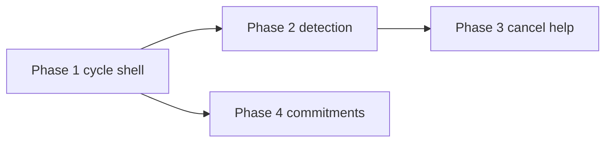

# Paycheck-cycle, observation-first budgeting, and subscription help — Implementation plan

> **For agentic workers:** Use `superpowers:subagent-driven-development` or `superpowers:executing-plans` to implement task-by-task. Steps use checkbox (`- [ ]`) syntax for tracking.

**Status:** Approved (2026-04-01). **Phases 1–4 shipped** (pay schedule, recurring suggestions, cancel guides, cycle commitments + review + NBA).

**Goal:** Implement the approved design in `docs/superpowers/specs/2026-04-01-paycheck-cycle-observation-first-design.md` in four vertical slices: **cycle shell** → **recurrence/subscription candidates** → **cancellation help** → **cycle commitments**.

**Architecture:** Add **household-level pay schedule + optional last-pay anchor** to compute `cycle_start`, `cycle_end` (next expected pay date). Expose a small **PayCycle** (or **CashCycle**) API consumed by the **home dashboard** and reports. Keep **calendar month** for existing `/budget/month/{month}` and assignment model; add **date-range** queries everywhere the observation-first UI needs spend truth (reuse and extend `GET /reports/spending-by-category` with `date_from` / `date_to` — already supported). **Recurring** work layers on `RecurringTransaction` (`is_subscription` already exists) plus **detection** from transactions. **Cancellation** layers **curated merchant data** (verified URLs/steps) + optional **LLM copy** only under AI trust rules (no unverified links as facts).

**Tech stack:** FastAPI, SQLAlchemy async, Alembic, pytest; Next.js App Router, TanStack Query.

**Design decisions locked for v1 (from spec open questions):**

| Topic | Decision |
|-------|----------|
| Multiple pay cycles | **Single primary** schedule per household; secondary income = same window or manual “mark as income” on transactions (defer multi-anchor cycles). |
| Next pay inference | **Explicit schedule required** for full experience; **suggest** next/last pay from large inflow transactions to prefill onboarding only. |
| Curated cancel depth | Ship **small allowlist** (10–30 top merchants) with verified links before any LLM-authored URLs; long tail = generic steps + “search billing site for …”. |

---

## File structure (create / modify)

| Path | Responsibility |
|------|------------------|
| `backend/alembic/versions/…_household_pay_schedule.py` | New nullable columns on `households` (or dedicated table if you prefer normalization) |
| `backend/app/models/household.py` | Map new fields |
| `backend/app/services/pay_cycle.py` | Pure functions: `compute_cycle_bounds(today, schedule) → (start, end, label)`; fallback rolling window |
| `backend/app/schemas/pay_cycle.py` | Pydantic response for API |
| `backend/app/api/routes/household.py` or `settings.py` | `GET/PATCH` pay schedule + resolved cycle (or split read-only cycle under `/reports` — pick one router, document in OpenAPI) |
| `backend/app/api/routes/reports.py` | Optional `GET /spending-summary` or ensure existing endpoints cover cycle totals + top categories in one round-trip for home |
| `backend/tests/test_pay_cycle.py` | Unit tests for date math (biweekly, semi-monthly, monthly edge cases) |
| `frontend/src/lib/api/household.ts` (or extend existing) | Fetch/update schedule, fetch cycle |
| `frontend/src/app/settings/page.tsx` | Pay schedule form + “next pay” preview |
| `frontend/src/app/page.tsx` | Observation-first header: cycle range; charts using `date_from`/`date_to`; RTA/month pivot secondary or behind toggle |
| `backend/app/services/recurring_detection.py` | Cluster outflows by normalized payee/description + amount tolerance + interval |
| `backend/app/api/routes/recurring.py` (or new) | `GET /recurring/suggestions?date_from&date_to` returning candidates not yet linked to `RecurringTransaction` |
| `frontend/src/app/recurring/page.tsx` | Confirm/dismiss suggestions; promote to create recurring + `is_subscription` |
| `backend/data/merchant_cancel_guides.json` (or YAML) | Curated `merchant_key`, `display_name`, `verified_cancel_url`, `steps_markdown`, `source_note` |
| `backend/app/api/routes/subscriptions.py` | `GET /subscriptions/guides/{merchant_key}` or lookup by payee name fuzzy match |
| `backend/app/api/routes/ai.py` | Optional tool or evidence type: “subscription_candidate” with **guide_id** only when curated row exists |
| `frontend/src/components/…` | Subscription review card, cancel sheet with verified vs generic labeling |
| `backend/app/models/cycle_commitment.py` + migration | Lightweight rows: `household_id`, `cycle_start`, `body`, `kind`, `created_at`, `dismissed_at` (or reuse/extend `financial_goals` if you want fewer tables — decide in Task 4) |
| `docs/mockups/ux-phases-1-4.html` | Optional: align mock scenario copy with paycheck header (non-blocking for backend work) |

---

## Phase 1 — Cycle shell (no AI)

### Task 1: Data model for pay schedule

**Files:** `backend/migrations/004_household_pay_schedule.sql`, `backend/app/models/household.py`, Pydantic on `settings` routes.

- [x] **Fields on `households`:** `pay_frequency`, `pay_last_confirmed_date`, `budget_framing` (default `strict`). Semimonthly deferred.

- [x] **Migration:** `004_household_pay_schedule.sql` (run manually on Postgres).

- [x] **Convention:** Store **last** payday; next pay derived in `pay_cycle.py`.

### Task 2: `pay_cycle` service (pure logic)

**Files:** `backend/app/services/pay_cycle.py`, `backend/tests/test_pay_cycle.py`

- [x] **`resolve_pay_cycle`:** inclusive `date_from` / `date_to` for reports; `next_pay_date`; label; 30-day fallback when irregular / unset.

- [x] **Tests:** weekly, biweekly, monthly, roll-forward, fallback (`test_pay_cycle.py`).

### Task 3: API — read/update schedule + resolved cycle

**Files:** `backend/app/api/routes/settings.py` (schemas inline).

- [x] **`GET /settings/pay-schedule`** — schedule + resolved cycle (`date.today()`).

- [x] **`PUT /settings/pay-schedule`** — validate; return updated cycle.

- [ ] **Tests:** API integration test (deferred).

### Task 4: Home dashboard — observation-first header and scoped charts

**Files:** `frontend/src/app/page.tsx`, `frontend/src/lib/api/settings.ts`

- [x] **Spend window** line + next pay + Settings link.

- [x] **Spending pie:** `date_from` / `date_to` from resolved cycle once pay schedule loads (includes 30-day fallback).

- [x] **Budget month:** RTA unchanged (calendar); note under card when **reflective**.

- [x] **`budget_framing`:** reflective de-emphasizes RTA (copy + opacity).

### Task 5: Settings — pay schedule UX

**Files:** `frontend/src/app/settings/page.tsx`

- [x] Form: frequency, last payday, reflective/strict.

- [x] Inline preview: current window + next pay.

---

## Phase 2 — Recurring and subscription candidates

### Task 6: Detection service

**Files:** `backend/app/services/recurring_detection.py`, `backend/tests/test_recurring_detection.py`

- [x] Input: `household_id`, `lookback_days` (30–730, default 90), `today` injectable for tests.

- [x] **Heuristics v1:** budget-account outflows only; cluster by `payee_id` + similar amounts (±2% or ±$1); ≥2 charges; infer `weekly` / `biweekly` / `monthly` / `quarterly` / `yearly` from median day gap; exclude existing recurring with same payee + similar amount; exclude `recurring_suggestion_dismissals`.

- [x] Output: `dedupe_key`, amounts, frequency, counts, `suggested_next_date`, `confidence`, mode category/account.

### Task 7: API + UI

**Files:** `backend/app/api/routes/recurring.py`, `backend/app/schemas/recurring.py`, `backend/migrations/005_recurring_suggestion_dismissals.sql`, `frontend/src/app/recurring/page.tsx`, `frontend/src/lib/api/recurring.ts`

- [x] **`GET /recurring/suggestions?lookback_days=`** — list `RecurringSuggestionResponse`.

- [x] **`POST /recurring/suggestions/dismiss`** — persists dismissal per household (`recurring_suggestion_dismissals`).

- [x] Recurring page: **Suggested from your spending** card; **Add as recurring** (prefills form, `is_subscription: true`); **Dismiss**.

- [x] **`tests/conftest.py`** — sets `SECRET_KEY` when missing so imports that load `app.models` collect under pytest.

---

## Phase 3 — Cancellation help

### Task 8: Curated guides artifact

**Files:** `backend/data/merchant_cancel_guides.json`, `backend/app/services/cancel_guides.py`, `backend/tests/test_cancel_guides.py`

- [x] JSON fields + `verification` enum; community entries do not get `link_is_verified` in API.

- [x] **18** seeded merchants (streaming, SaaS, fitness, news, etc.).

### Task 9: Lookup API

**Files:** `backend/app/api/routes/subscriptions.py`, `backend/app/schemas/subscriptions.py`, registered under `/subscriptions`.

- [x] **`GET /subscriptions/cancel-guide?payee_name=`** — fuzzy alias match; always **200** with `matched` + `generic_steps`.

### Task 10: AI alignment (optional in Phase 3, recommended thin slice)

- [ ] **Deferred** — Advisor cancel URLs should only come from curated `merchant_key` when we add an explicit tool/evidence path.

### Task 11: Frontend cancel experience

**Files:** `frontend/src/components/cancel-guide-dialog.tsx`, `frontend/src/lib/api/subscriptions.ts`, `frontend/src/app/recurring/page.tsx`

- [x] **How to cancel** on suggestions + **Cancel help** on recurring rows (payee name).

- [x] Local-only **checkbox** reminder (not persisted); generic checklist always returned from API.

---

## Phase 4 — Decide / commitments

### Task 12: Persist 1–3 commitments per cycle

**Files:** `backend/migrations/006_cycle_commitments_and_review.sql`, `backend/app/models/cycle_commitment.py`, `backend/app/schemas/cycle_commitment.py`, `backend/app/api/routes/cycle_commitments.py`

- [x] **`cycle_commitments`** table + JSON `payload`; **max 3 active** per `(household_id, cycle_start_date)`.

- [x] **`GET/POST /cycle-commitments`**, **`PATCH/DELETE /cycle-commitments/{id}`** — list/create scoped to **current** resolved pay cycle.

### Task 13: Home / NBA surfacing

**Files:** `frontend/src/components/next-best-action.tsx`

- [x] After stale sync: **pay schedule missing** → Settings; **≥3 recurring suggestions** → Recurring; after core budget hygiene: **review step &lt; 3** → `/#cycle-review`; **review complete + active commitments** → `/#cycle-review`.

### Task 14: Phase resume (lightweight)

**Files:** `households.cycle_review_step`, `households.cycle_review_cycle_start`, `GET/PUT /settings/pay-schedule` + **`PUT /settings/cycle-review`**, `frontend/src/components/cycle-review-section.tsx`, `frontend/src/app/page.tsx`

- [x] **Server-stored** step `0–3`; **auto-reset** when resolved `cycle.date_from` changes (`_sync_cycle_review_anchor` on pay-schedule GET/PUT).

- [x] Dashboard **This pay cycle** card (`id="cycle-review"`) with step buttons + commitments UI.

**Demo guard:** `POST/PATCH/DELETE` under `/api/cycle-commitments` and `PUT /api/settings/cycle-review` allowlisted in `demo_guard.py`.

---

## Testing and QA matrix

| Area | Tests |
|------|--------|
| Pay cycle math | Heavy unit coverage (`test_pay_cycle.py`) |
| API | Async integration for GET/PATCH cycle |
| Detection | Fixed fixture transactions → expected clusters |
| Guides | JSON schema + lookup golden files |
| Frontend | Smoke: settings save → home header updates; chart query params |

**Manual QA:** Change system date edge (optional); biweekly user across two months; `irregular` + empty anchor → 30-day banner.

---

## Dependencies and order

Phase 4 can start after Phase 1 if commitments are **text-only**; **cancel-linked** commitments benefit from Phase 2 IDs.

---

## Out of scope (explicit)

- Changing **budget assignment granularity** from calendar month to pay cycle (large product + migration).
- **Automatic** subscription cancellation via third-party APIs.
- **Legal** claims around disputes or refunds.
- **Timezone-perfect** pay boundaries for travelers (v1 server date is acceptable).

---

## References

- Spec: `docs/superpowers/specs/2026-04-01-paycheck-cycle-observation-first-design.md`
- AI trust: `docs/superpowers/specs/2026-04-01-ai-trust-actions-ux-design.md`
- Existing reports: `backend/app/api/routes/reports.py` (`date_from` / `date_to` on spending-by-category)
- Existing recurring: `backend/app/models/recurring.py`, `backend/app/api/routes/recurring.py`
