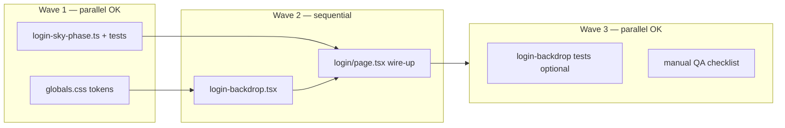

# Login backdrop — planes + dotted wake (Option A) — Implementation plan

> **For agentic workers:** Execute in **order per dependency graph** unless a wave is marked **parallel**. Use checkboxes. After any **parallel wave**, one owner merges, runs `npm run lint` + `npm run test:run` from `frontend/`, then continues.

**Status:** Ready for implementation  
**Spec:** `docs/superpowers/specs/2026-04-05-login-backdrop-plane-trail-design.md`  
**Reference mockup:** `docs/mockups/trail-comparison.html` (panel A)

**Goal:** `/login` shows ambient paper planes with **curved dotted contrails** (wake-only: mask + compound `stroke-dasharray`), themed via **`data-login-sky`** and **`--login-*` CSS variables** for **dawn / day / dusk / night**, with spec §6 edge cases implemented.

**Stack:** Next.js App Router, React 19, Tailwind v4, existing `ThemeProvider` in `frontend/src/lib/providers.tsx`.

---

## Dependency overview



- **Wave 1:** `globals.css` and `lib/login-sky-phase.ts` touch **disjoint files** → safe for **two parallel agents**. Agree on **`SkyPhase`** type and **`data-login-sky`** attribute values (`dawn` | `day` | `dusk` | `night`) before starting (frozen below).
- **Wave 2:** Single agent (or strict handoff): backdrop component **depends on** CSS variable names; page **depends on** backdrop + sky helper.
- **Wave 3:** Optional tests can run parallel to manual QA; both need Wave 2 done.

---

## Frozen contract (do not drift between agents)

| Item | Value |
|------|--------|
| `SkyPhase` literals | `'dawn' \| 'day' \| 'dusk' \| 'night'` |
| DOM | Login root wrapper sets `data-login-sky={phase}` (in addition to `.dark` on `html` from theme) |
| CSS variables | `--login-sky-gradient-from`, `--login-sky-gradient-to` **or** a single `--login-sky-gradient` usable in `style` / arbitrary Tailwind; `--login-trail-stroke`; `--login-trail-width`; `--login-trail-dash` (full `stroke-dasharray` string, e.g. `3 14`); `--login-plane-fill`; `--login-plane-stroke` (optional, `none` allowed); `--login-mask-stroke-width` (mask fat stroke, ~6× trail width baseline) |
| SVG theming | Trail/plane use **`stroke="currentColor"`** / **`fill="currentColor"`** where applicable; parent `<g>` or wrapper sets `className` / `style={{ color: 'var(--login-trail-stroke)' }}` for trails; plane fill via separate wrapper or `fill` from `var(--login-plane-fill)` if `currentColor` insufficient |
| Backdrop root class | `login-backdrop` (for `print` hiding and stacking) |

---

## Wave 1 — parallel

### Track A — CSS tokens (`frontend/src/app/globals.css`)

**Owner:** Agent A — **only** `globals.css` (no TSX).

- [ ] **A1.** Define defaults on `:root` for all `--login-*` vars so the app never reads undefined (use **day**-like values for light default).
- [ ] **A2.** Under `html.dark` (or `.dark` root as project uses), set **night**-aligned defaults when `data-login-sky` is **absent** (MVP bridge: dark theme ⇒ night palette, light ⇒ day palette).
- [ ] **A3.** Add **`html[data-login-sky="dawn"]`**, `[data-login-sky="day"]`**, `[data-login-sky="dusk"]`**, `[data-login-sky="night"]`** — each overrides the same `--login-*` set. Tune OKLCH so **dotted trails** read on each gradient (spec §4.1).
- [ ] **A4.** `@media (prefers-contrast: more)` — increase `--login-trail-width` and trail/plane contrast.
- [ ] **A5.** `@media print { .login-backdrop { display: none; } }` (or `visibility: hidden`).

**Acceptance:** No TS errors; toggling `data-login-sky` on a test div in DevTools visibly changes computed styles.

---

### Track B — Sky phase helper + unit tests

**Owner:** Agent B — **only** `frontend/src/lib/login-sky-phase.ts` and `frontend/src/lib/login-sky-phase.test.ts` (create both).

- [ ] **B1.** Export `type SkyPhase = 'dawn' | 'day' | 'dusk' | 'night'`.
- [ ] **B2.** Export `getLoginSkyPhase(date: Date, theme: 'light' | 'dark'): SkyPhase`:
  - Use **local hour** buckets (document ranges in file comment). **Default suggestion:** `night` 22–5, `dawn` 5–8, `day` 8–17, `dusk` 17–22 (local time); adjust after visual review.
  - **MVP behavior:** When you want theme-only mode, document that callers may **override** by mapping `theme === 'dark' ? 'night' : 'day'` until four-phase UI is enabled — or add optional param `options?: { mode: 'clock' | 'theme' }` (pick one approach and test it).
- [ ] **B3.** Vitest table tests: fixed `Date` + `theme` → expected phase.
- [ ] **B4.** No imports from React; pure functions only.

**Acceptance:** `cd frontend && npm run test:run -- login-sky-phase` passes.

---

### Copy-paste prompts for Wave 1 (Task tool)

**Prompt A — CSS track**

```text
Repo: budget-app. Implement ONLY frontend/src/app/globals.css changes for the login sky design.

Requirements:
- Add --login-* CSS variables per docs/superpowers/plans/2026-04-05-login-backdrop-plane-trail.md "Frozen contract".
- MVP: when data-login-sky is absent, html.dark uses night-like tokens; light uses day-like tokens.
- Add html[data-login-sky="dawn"|"day"|"dusk"|"night"] overrides (four palettes, OKLCH).
- prefers-contrast: more bumps trail width and contrast.
- @media print hides .login-backdrop.

Do not modify any .tsx/.ts files. Return summary and diff paths.
```

**Prompt B — Sky phase track**

```text
Repo: budget-app. Add frontend/src/lib/login-sky-phase.ts and frontend/src/lib/login-sky-phase.test.ts only.

Export SkyPhase and getLoginSkyPhase(date, theme) with hour buckets (comment the ranges). Include Vitest tests with fixed Dates.

Do not modify globals.css or login page. Run: cd frontend && npm run test:run -- login-sky-phase

Return file contents summary and test output.
```

---

## Wave 2 — sequential (single owner recommended)

### Task C — `frontend/src/components/login/login-backdrop.tsx`

**Prerequisites:** Wave 1 merged (CSS vars exist).

- [ ] **C1.** `'use client'`; container `className="login-backdrop fixed inset-0 z-0 pointer-events-none overflow-hidden"` (z-index **below** card — page may use `relative z-10` on content).
- [ ] **C2.** SVG `viewBox` covering logical space (e.g. `0 0 400 300` scaled with `preserveAspectRatio="xMidYMid slice"` and `w-full h-full`).
- [ ] **C3.** Implement **Option A** per spec §3.2: for each plane, visible path with `stroke-dasharray` from **`var(--login-trail-dash)`** (via inline style on SVG root or CSS class), **mask** with duplicate path, white stroke, **`stroke-width` from `var(--login-mask-stroke-width)`**, compound trim updated each frame from shared `s`.
- [ ] **C4.** **currentColor** pattern: wrap trail paths in `<g style={{ color: 'var(--login-trail-stroke)' }}>` with `stroke="currentColor"`.
- [ ] **C5.** **≥2 planes**, different `path` `d` or same `d` with staggered phase `u0` and optional `opacity` / duration variance.
- [ ] **C6.** **Edge cases:** `getTotalLength() < 2` skip; `visibilitychange` pause RAF; RAF starts in `useEffect` only; optional reduced plane count on `max-width` media query.
- [ ] **C7.** **Reduced motion:** if `prefers-reduced-motion: reduce`, render nothing or static non-animated decor (spec §5).

**Acceptance:** Visual smoke on `/login` after Task D; DevTools → no RAF when tab hidden.

---

### Task D — `frontend/src/app/login/page.tsx`

**Prerequisites:** Task C done.

- [ ] **D1.** Wrap page content in an outer `div` with `className="relative min-h-screen"` (or equivalent): **backdrop** first child, **card column** second with `relative z-10` (or higher).
- [ ] **D2.** Background: use token-driven gradient (e.g. `style={{ background: linear-gradient(... var(--login-sky-gradient-from), var(--login-sky-gradient-to)) }}` or single var) — **remove** reliance on generic `from-background to-muted` for this page if spec calls for sky-specific gradient.
- [ ] **D3.** `useTheme()` + `getLoginSkyPhase(new Date(), theme)`; set **`data-login-sky={phase}`** on the wrapper (or on `html` only if team prefers — **prefer wrapper** to avoid global side effects).
- [ ] **D4.** Optional: `useEffect` + interval or `setTimeout` at next hour boundary to recompute phase (or keep simple: recompute on render + theme toggle only for v1 — document tradeoff).

**Acceptance:** Toggling light/dark updates phase mapping; time-of-day changes attribute when interval/hook implemented.

---

## Wave 3 — parallel (post Wave 2)

### Track E — Tests

**Owner:** Agent E — `frontend/src/components/login/login-backdrop.test.tsx` (and mocks).

- [ ] **E1.** Mock `matchMedia` for `prefers-reduced-motion: reduce` → backdrop renders **no** RAF-driven SVG (or empty).
- [ ] **E2.** Smoke: default motion → component mounts without throw (use `vi.useFakeTimers` carefully if testing RAF).

### Track F — Manual QA

- [ ] **F1.** Four `data-login-sky` values + light/dark: trail readable, mask not clipping dots on sharpest path.
- [ ] **F2.** Reduced motion, high contrast, background tab, print preview (spec §7).

---

## Verification commands (full frontend after Wave 2+)

```bash
cd frontend && npm run lint && npm run test:run && npm run build
```

Use **`npm run test:run -- login-sky`** for targeted iteration.

---

## Parallelization summary

| Wave | Parallel? | Files touched |
|------|-----------|----------------|
| 1 | **Yes — 2 agents** | Agent A: `globals.css` only. Agent B: `login-sky-phase.ts` + `.test.ts` only. |
| 2 | **No** | `login-backdrop.tsx` then `login/page.tsx` (same branch, same owner avoids conflicts). |
| 3 | **Yes — soft** | Tests (E) vs manual QA (F); E touches only test files. |

**Do not** run two agents on `login/page.tsx` and `login-backdrop.tsx` simultaneously — overlapping integration risk per `.cursor/rules/subagents-and-parallel-work.mdc`.

---

## Risks and mitigations

| Risk | Mitigation |
|------|------------|
| SVG `var()` in attributes | Prefer **`currentColor`** + wrapper `color` (spec + frozen contract). |
| Merge conflict after Wave 1 | Rebase before starting Wave 2; run lint/test once after merging A+B. |
| RAF battery drain | **visibility** pause (Task C6). |

---

## Out of scope

- Backend, auth, demo mode logic.
- Closed-loop flight paths (defer v2).
- Sun position API.
- `docs/mockups/trail-comparison.html` updates (optional polish).
